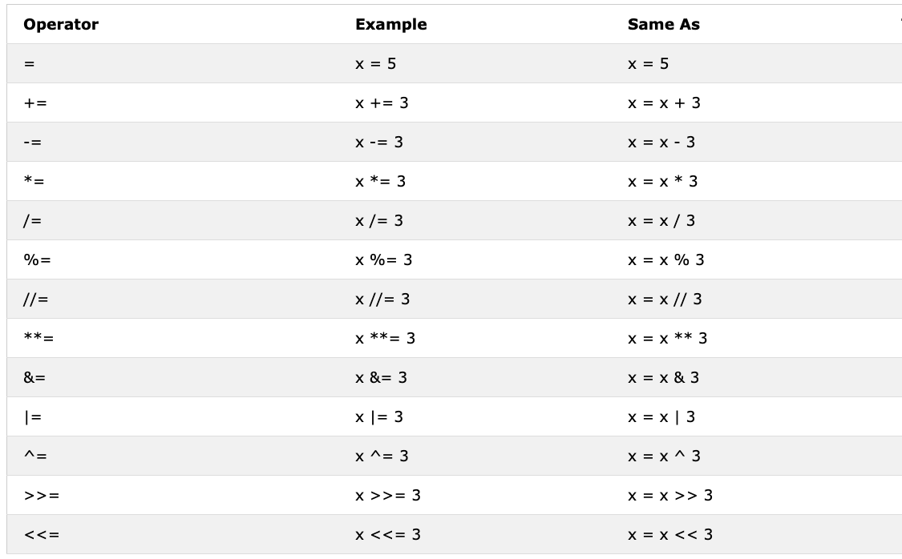

## Boolean

The boolean data type in Python represents one of two values: _True_ or _False_. These values become particularly useful when working with comparison operators. It's crucial to note that in Python, the first letter of True and False must be capitalized, unlike in some other programming languages such as JavaScript.

**Example: Boolean Values**

```py
print(True)
print(False)
print(bool(1))    # True
print(bool(0))    # False
print(bool(""))   # False
print(bool([]))   # False
print(bool({}))   # False
```

## Operators

Python supports various types of operators. Let's explore some of the most commonly used ones.

### Assignment Operators

Assignment operators are used to assign values to variables. The equal sign (=) in Python doesn't indicate equality as in mathematics; instead, it assigns a value to a variable. Here's a table showing different Python assignment operators, adapted from [w3school](https://www.w3schools.com/python/python_operators.asp).



**Example: Assignment Operators**

```py
x = 5
x += 3   # x = x + 3
print(x)  # 8
x -= 2   # x = x - 2
print(x)  # 6
x *= 4   # x = x * 4
print(x)  # 24
x /= 3   # x = x / 3
print(x)  # 8.0
x %= 5   # x = x % 5
print(x)  # 3.0
x **= 2  # x = x ** 2
print(x)  # 9.0
```

### Arithmetic Operators

Python provides several arithmetic operators for mathematical operations:

- Addition (+): a + b
- Subtraction (-): a - b
- Multiplication (_): a _ b
- Division (/): a / b
- Modulus (%): a % b
- Floor division (//): a // b
- Exponentiation (**): a ** b


**Example: Integers**

```py
# Arithmetic Operations with Integers

print('Addition: ', 1 + 2)        # 3
print('Subtraction: ', 2 - 1)     # 1
print('Multiplication: ', 2 * 3)  # 6
print('Division: ', 4 / 2)        # 2.0  Division in Python gives floating number
print('Division: ', 6 / 2)        # 3.0
print('Division: ', 7 / 2)        # 3.5
print('Floor Division: ', 7 // 2)   # 3,  gives without the floating number or without the remaining
print('Floor Division: ', 7 // 3)   # 2
print('Modulus: ', 3 % 2)         # 1, Gives the remainder
print('Exponentiation: ', 2 ** 3) # 8 it means 2 * 2 * 2
print('Order of Operations: ', 2 + 3 * 4)  # 14
print('Parentheses: ', (2 + 3) * 4)  # 20
```

**Example: Floats**

```py
# Operations with Floating Point Numbers
print('PI:', 3.14159)
print('Gravity:', 9.81)
print('Complex Calculation:', (3.14159 * 5**2) / 2)  # Area of a circle with radius 5
print('Temperature Conversion:', (98.6 - 32) * 5/9)  # Fahrenheit to Celsius
```

**Example: Complex Numbers**

```py
# Complex Number Operations
print('Complex number: ', 1 + 1j)
print('Multiplying complex numbers: ', (1 + 1j) * (1 - 1j))
print('Complex exponentiation: ', (1 + 1j) ** 2)
print('Complex conjugate: ', (1 + 1j).conjugate())
```

Let's declare variables and perform arithmetic operations. Remember to use descriptive variable names in your actual code.

**Example: Variable Arithmetic**

```python
# Declaring variables
length = 10
width = 5
height = 3

# Arithmetic operations
area = length * width
volume = length * width * height
perimeter = 2 * (length + width)

print('Rectangle Area:', area)
print('Box Volume:', volume)
print('Rectangle Perimeter:', perimeter)

# More complex calculations
diagonal = (length**2 + width**2) ** 0.5
print('Rectangle Diagonal:', diagonal)

density = 0.8  # g/cm^3
mass = volume * density
print('Box Mass (g):', mass)
```

**Example: Scientific Calculations**

```py
import math

# Constants
G = 6.67430e-11  # Gravitational constant
c = 299792458  # Speed of light in m/s

# Calculations
mass_earth = 5.97e24  # kg
radius_earth = 6.37e6  # m

escape_velocity = math.sqrt(2 * G * mass_earth / radius_earth)
print('Escape velocity from Earth:', escape_velocity, 'm/s')

energy = 1 * c**2  # E = mc^2 for 1 kg
print('Energy equivalent of 1 kg:', energy, 'J')

# Calculating orbital period
satellite_altitude = 35786000  # m (geostationary orbit)
orbital_radius = radius_earth + satellite_altitude
orbital_period = 2 * math.pi * math.sqrt(orbital_radius**3 / (G * mass_earth))
print('Geostationary orbital period:', orbital_period / 3600, 'hours')
```

### Comparison Operators

Comparison operators are used to compare values. They return boolean results (True or False). Here's a table of Python comparison operators:


**Example: Comparison Operators**

```py
x, y = 5, 10
print('x > y:', x > y)   # False
print('x < y:', x < y)   # True
print('x == y:', x == y) # False
print('x != y:', x != y) # True
print('x >= 5:', x >= 5) # True
print('y <= 10:', y <= 10) # True

# String comparisons
str1, str2 = "hello", "world"
print('str1 == str2:', str1 == str2) # False
print('str1 < str2:', str1 < str2)   # True (lexicographical comparison)
print('len(str1) > len(str2):', len(str1) > len(str2)) # False

# Object identity
list1 = [1, 2, 3]
list2 = [1, 2, 3]
list3 = list1
print('list1 is list2:', list1 is list2) # False
print('list1 is list3:', list1 is list3) # True
print('list1 == list2:', list1 == list2) # True
```

### Logical Operators

Python uses the keywords _and_, _or_, and _not_ for logical operations. These are used to combine conditional statements:


**Example: Logical Operators**

```py
x = 5
y = 10
z = 15

print('x < y and y < z:', x < y and y < z)  # True
print('x < y or y > z:', x < y or y > z)    # True
print('not (x < y):', not (x < y))          # False

# Short-circuit evaluation
print('False and (1/0):', False and (1/0))  # False (second part not evaluated)
print('True or (1/0):', True or (1/0))      # True (second part not evaluated)

# Combining multiple conditions
condition = (x < y) and (y < z) or (z > 20)
print('Complex condition:', condition)  # True

# Using parentheses for clarity
print('Parentheses change order:', (x < y or y > z) and z > x)  # True
```
