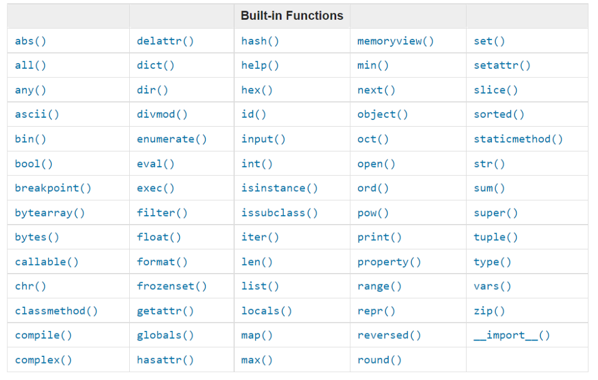
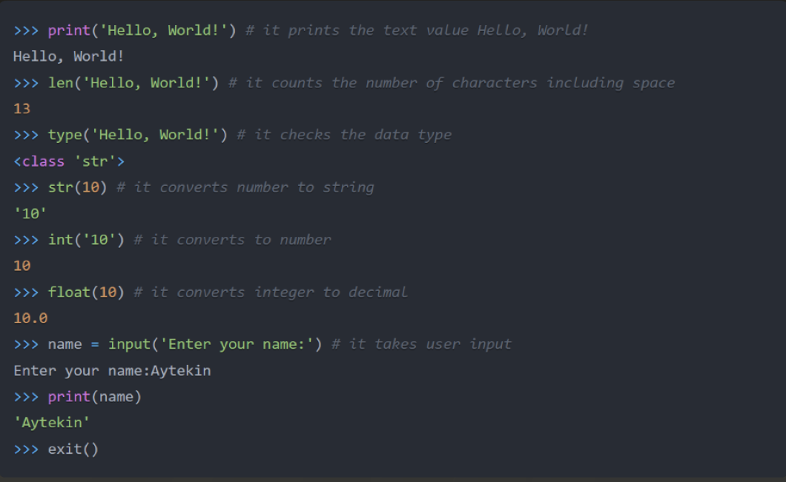
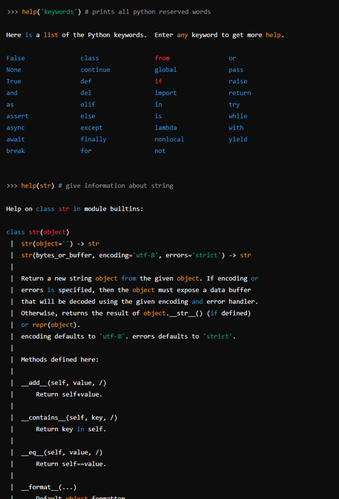
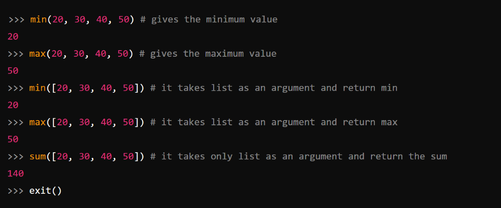

## Built-in Functions

Python provides numerous built-in functions, which are globally accessible, meaning you can use them without importing or configuring anything. Some commonly used Python built-in functions include: _print()_, _len()_, _type()_, _int()_, _float()_, _str()_, _input()_, _list()_, _dict()_, _min()_, _max()_, _sum()_, _sorted()_, _open()_, _help()_, and _dir()_. Below is a list of built-in Python functions taken from [Python documentation](https://docs.python.org/3.9/library/functions.html).



Let’s start experimenting with a few of these in a Python shell.



Now, let’s practice some more by utilizing different built-in functions.



As seen from the terminal output, Python has reserved words that should not be used to declare variables or functions. We’ll cover variables in more detail later.

At this point, you should be comfortable with built-in functions. Let’s take one more look at some built-in functions before moving on.



## Variables

In programming, variables are used to store data in memory. It's recommended to use mnemonic variable names—names that are easy to remember and are descriptive. A variable represents a memory address that holds data.

Variable names cannot start with a number or contain special characters like hyphens or dollar signs. A variable name can be brief (e.g., x, y, z) or more descriptive (e.g., firstname, lastname, age, country).

### Python Variable Naming Rules

- Variable names must begin with a letter or underscore (\_).
- They cannot start with a number.
- They can only contain alphanumeric characters and underscores (A-z, 0-9, and \_).
- Variable names are case-sensitive (e.g., firstname, Firstname, FirstName, and FIRSTNAME are all different).

Here are examples of valid variable names:

```shell
firstname
lastname
age
country
city
first_name
last_name
capital_city
_if  # using underscore to avoid reserved word conflict
year_2021
year2021
current_year_2021
birth_year
num1
num2
```

Examples of invalid variable names:

```shell
first-name
first@name
first$name
num-1
1num
```

In Python, developers often use **snake_case** for naming variables, where underscores are used between words (e.g., `first_name`, `engine_rotation_speed`). Below is an example of proper variable naming, particularly when more than one word is needed.

Declaring variables in Python involves assigning a specific value to them. The assignment operator `=` is used to store data in the variable. Unlike mathematics, `=` in Python is not used for equality but assignment.

**Example:**

```py
# Variables in Python
first_name = 'Aytekin'
last_name = 'Kaplan'
country = 'Turkey'
city = 'Istanbul'
age = 30
is_married = True
skills = ['Python', 'JavaScript', 'React']
person_info = {
   'firstname': 'Aytekin',
   'lastname': 'Kaplan',
   'country': 'Turkey',
   'city': 'Istanbul'
}
```

Let’s use the _print()_ and _len()_ functions. The `print` function accepts a variable number of arguments. Each value passed is considered an argument. Below is an example of how this works.

**Example:**

```py
print('Hello, World!')  # The string 'Hello, World!' is an argument
print('Hello', ',', 'World', '!')  # Multiple arguments: 4 in total
print(len('Hello, World!'))  # It takes a single argument
```

Let’s now print the variables declared earlier and check their lengths:

**Example:**

```py
# Printing the values stored in variables

print('First name:', first_name)
print('First name length:', len(first_name))
print('Last name: ', last_name)
print('Last name length: ', len(last_name))
print('Country: ', country)
print('City: ', city)
print('Age: ', age)
print('Married: ', is_married)
print('Skills: ', skills)
print('Person information: ', person_info)
```

### Declaring Multiple Variables on One Line

You can declare several variables at once, all in a single line:

**Example:**

```py
first_name, last_name, country, age, is_married = 'Aytekin', 'Kaplan', 'Turkey', 30, True

print(first_name, last_name, country, age, is_married)
print('First name:', first_name)
print('Last name: ', last_name)
print('Country: ', country)
print('Age: ', age)
print('Married: ', is_married)
```

To capture user input, we can use the _input()_ function. Let's assign user input to `first_name` and `age`:

**Example:**

```py
first_name = input('What is your name: ')
age = input('How old are you? ')

print(first_name)
print(age)
```

## Data Types

In Python, several data types exist. To determine the data type of a value, we use the _type()_ function. Mastering data types is essential for programming because everything in programming revolves around data types. While I’ve introduced them earlier, we’ll now explore them in more detail.

## Checking Data Types and Casting

- **Check Data Types:** To check the type of any variable or value, we use the _type()_ function.

  **Example:**

```py
# Different Python data types
# Let's declare variables with various data types

first_name = 'Aytekin'      # str
last_name = 'Kaplan'        # str
country = 'Turkey'          # str
city = 'Istanbul'           # str
age = 30                    # int

# Checking data types
print(type('Aytekin'))      # str
print(type(first_name))     # str
print(type(10))             # int
print(type(3.14))           # float
print(type(1 + 1j))         # complex
print(type(True))           # bool
print(type([1, 2, 3]))      # list
print(type({'name': 'Aytekin', 'age': 30}))  # dict
print(type((1, 2)))                              # tuple
print(type({1, 2, 3}))                           # set
```

- **Casting:** Casting involves converting one data type into another. Python provides functions like _int()_, _float()_, _str()_, _list()_, and _set()_ for casting. For instance, when performing arithmetic with numbers as strings, those strings must first be converted into integers or floats.

  **Example:**

```py
# int to float
num_int = 10
print('num_int:', num_int)      # 10
num_float = float(num_int)
print('num_float:', num_float)  # 10.0

# float to int
gravity = 9.81
print(int(gravity))            # 9

# int to str
num_int = 10
print(str(num_int))            # '10'

# str to int or float
num_str = '10.6'
print(int(float(num_str)))     # 10
print(float(num_str))          # 10.6

# str to list
first_name = 'Aytekin'
print(list(first_name))        # ['A', 'y', 't', 'e', 'k', 'i', 'n']
```

---
